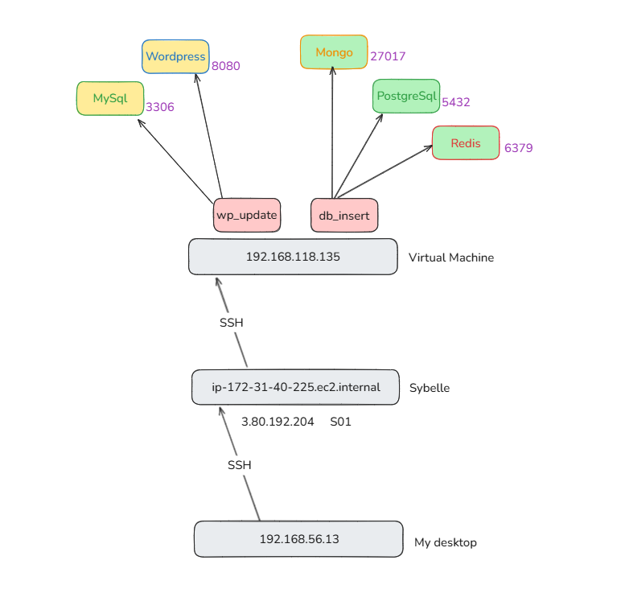
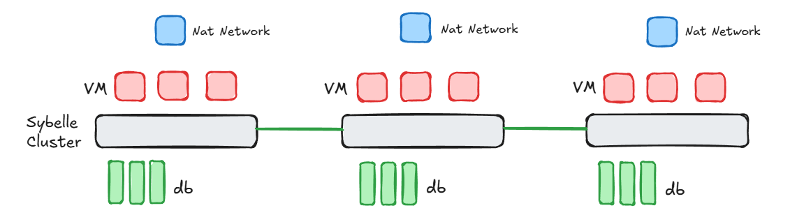

# Wordpress-Database-System-Design-Project

This project is a multi-container Docker setup designed to showcase various database and application interactions. It includes the integration of relational, NoSQL, and in-memory databases, along with Python applications, and a WordPress environment.

## Project Structure

```
Wordpress-Database-System-Design-Project/
├── compose_1/
│   ├── docker-compose.yml  # Docker Compose file for WordPress and MySQL setup
│
├── compose_2/
│   ├── docker-compose.yml  # Docker Compose file for PostgreSQL, MongoDB, Redis, and custom apps
│   ├── Dockerfile-1        # Dockerfile for the Python application
│   ├── Dockerfile-2        # Dockerfile for the Python application
│   ├── requirements.txt    # Python dependencies
│   ├── script1.py          # Python script for insert data in Sql, NoSql and Cache memory
│   ├── script2.py          # Python script for update wordpress blog
│
├── README.md               # Documentation for the project
├── startup.sh              # Script to automate the startup of all services
```

---

## System Design with Sybelle 



# BONUS



- Edit VM and add new Network Interface: Add Network vmNet01 and Network Profile vmPort01.
- An IP address is assigned to this interface with the `sudo ip addr add 1.1.1.66/24 dev enp7s0` command. (1.1.1.66 is Public IP example)
- Network Configuration:

1) In the Sybelle platform, determine the private IP addresses assigned to your virtual machines.
NAT (Network Address Translation) or Routing Settings:

2) In the network settings of the Sybelle platform, configure the necessary NAT or routing rules to make your virtual machines accessible over the internet.
Firewall and Security Groups:

3) Check your virtual machines' firewall settings and make sure HTTP (port 80) and HTTPS (port 443) traffic is allowed.
DNS Configuration:

4) If you have a domain name, point your domain name to your virtual machine's IP address by creating the appropriate A or CNAME records in the DNS settings.

## Setup Instructions

### Prerequisites

- Docker and Docker Compose installed on your system.

### Step 1: Clone the Repository

```bash
git clone <repository_url>
cd Wordpress-Database-System-Design-Project
```

### Step 2: Start the Services

Run the `startup.sh` script to start all services:

```bash
chmod +x startup.sh
./startup.sh
```

This script will:

1. Start the WordPress and MySQL setup defined in `compose_1`.
2. Start the PostgreSQL, MongoDB, Redis, and custom applications defined in `compose_2`.

---

## Services Overview

### Compose 1: WordPress and MySQL

- **MySQL**: Relational database for WordPress.
- **WordPress**: Content management system running on Apache.

Access WordPress at: [http://ipadress:8080](http://ipadress:8080)

### Compose 2: Databases and Applications

- **PostgreSQL**: Relational database.
- **MongoDB**: NoSQL document-based database.
- **Redis**: In-memory key-value store.
- **Custom Applications**:
  - Python application (`script2.py`): Demonstrates database interactions.

---

## File Descriptions

### compose\_1/

- `docker-compose.yml`: Defines services for WordPress and MySQL, along with networking and persistent storage.

### compose\_2/

- `docker-compose.yml`: Defines services for PostgreSQL, MongoDB, Redis, and custom applications.
- `Dockerfile-1`: Builds the Go application container.
- `Dockerfile-2`: Builds the Python application container.
- `requirements.txt`: Lists Python dependencies for `script2.py`.
- `script1.py`: Placeholder script for additional functionality.
- `script2.py`: Python script to write and read data from PostgreSQL, MongoDB, and Redis.

### Root Directory

- `README.md`: Documentation for the project.
- `startup.sh`: Automates the startup of all services.

---

## Usage

### Accessing the Databases

1. **PostgreSQL**:

   - Host: `localhost`
   - Port: `5432`
   - Database: `mydb`
   - User: `user`
   - Password: `password`

   Example query:

   ```sql
   SELECT * FROM test;
   ```

2. **MongoDB**:

   - Host: `localhost`
   - Port: `27017`
   - Database: `test_db`
   - Collection: `test_collection`

   Example query:

   ```bash
   db.test_collection.find();
   ```

3. **Redis**:

   - Host: `localhost`
   - Port: `6379`

   Example query:

   ```bash
   redis-cli get message
   ```

### Logs

To view logs of a specific container:

```bash
docker logs <container_name>
```

---

## Stopping the Services

To stop all running containers:

```bash
cd compose_1 && docker-compose down
cd ../compose_2 && docker-compose down
```

---

## Troubleshooting

- Ensure all Docker images are built correctly using `build.sh` before running the `startup.sh` script.
- Check container logs for errors using:
  ```bash
  docker logs <container_name>
  ```
- Verify the Docker network configuration if services cannot communicate.

---

## Future Improvements

- Add detailed monitoring for database and application performance.
- Implement CI/CD pipelines for automated testing and deployment.
- Enhance application functionality with additional scripts.

---

## Author

Abdullah Karakoç

---
